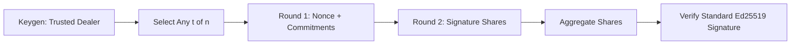

# crypto-lab-frost-threshold

**[Live Demo →](https://systemslibrarian.github.io/crypto-lab-frost-threshold/)**

Threshold signatures in the browser with FROST (RFC 9591), using real Ed25519 cryptography compiled from Rust to WASM.

No simulated primitives. No fake math. Live values only.

## The Problem

Imagine a team controls a shared account — a company wallet, a code-signing certificate, a server's identity key. If one person holds the private key, they become a single point of failure: they can go rogue, get hacked, or lose the key. If you copy the key to everyone, you've multiplied the attack surface.

What you really want is: **no single person can sign, but any minimum group can** — without ever putting the full key in one place.

That's what FROST solves. It splits a signing key into pieces so that, say, any 3 out of 5 keyholders can produce a valid signature together. The signature looks completely normal to the outside world — nobody can tell a group was involved. And the full private key is never reassembled at any point in the process.

This project is a hands-on, interactive demo of that protocol running entirely in your browser.

## What This Is
`crypto-lab-frost-threshold` is part of the **systemslibrarian crypto-lab collection** and demonstrates:
- trusted dealer key generation for t-of-n signing
- two-round FROST signing (nonce commitments, then signature shares)
- aggregation into a standard Ed25519 signature
- proof that different valid signer subsets still verify against the same group key

## Protocol Pipeline


## Crypto Stack
| Layer | Choice |
|---|---|
| Standard | RFC 9591 (FROST) |
| Group | Ed25519 |
| Rust crate | `frost-ed25519` |
| Randomness | `getrandom` (Web Crypto on wasm32) |
| Bridge | `wasm-bindgen` + `serde-wasm-bindgen` |
| Frontend | Vite + TypeScript (strict) + Tailwind CSS |
| Deploy | GitHub Pages |

## How It Works
1. **Keygen**
- Generates one group verifying key and `n` secret shares.
- Each share includes identifier + scalar + VSS commitments.

2. **Round 1**
- Each selected signer creates fresh hiding/binding nonces.
- Nonce commitments are public, nonces remain secret.

3. **Round 2**
- Each signer computes a signature share bound to message + commitment list.

4. **Aggregation**
- Coordinator verifies and combines shares into a standard 64-byte Ed25519 signature.

5. **Verification**
- Result verifies with normal Ed25519 verification; verifier does not need threshold metadata.

## Local Setup
### Prerequisites
- Node.js 20+
- Rust stable (`rustup`)
- `wasm-pack`

### Install
```bash
npm install
```

### Build WASM
```bash
npm run wasm
```

### Run Dev Server
```bash
npm run dev
```

### Typecheck
```bash
npm run typecheck
```

### Rust Tests
```bash
cargo test --manifest-path crate/Cargo.toml
```

## Repository Layout
```
crate/                  # Rust WASM core
src/                    # TypeScript exhibits + UI state
src/exhibits/           # Keygen, selection, rounds, aggregation, subset proof
src/ui/                 # State manager + display helpers
SPEC.md                 # Protocol specification
THREAT_MODEL.md         # Security boundaries
.github/workflows/      # GitHub Pages deployment
```

## Related Projects
- [blind-oracle](https://github.com/systemslibrarian/blind-oracle)
- [shadow-vault](https://github.com/systemslibrarian/shadow-vault)
- [zk-proof-lab](https://github.com/systemslibrarian/zk-proof-lab)
- [crypto-lab collection](https://github.com/systemslibrarian)

So whether you eat or drink or whatever you do, do it all for the glory of God. - 1 Corinthians 10:31
